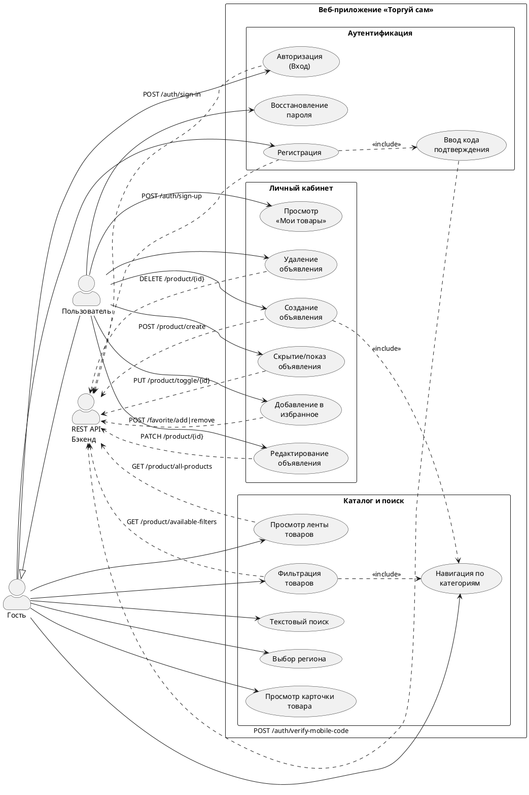
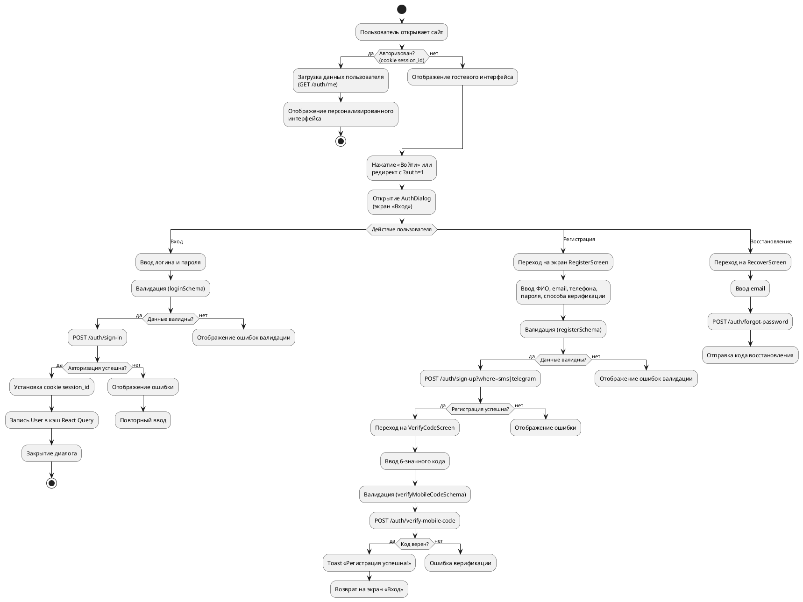
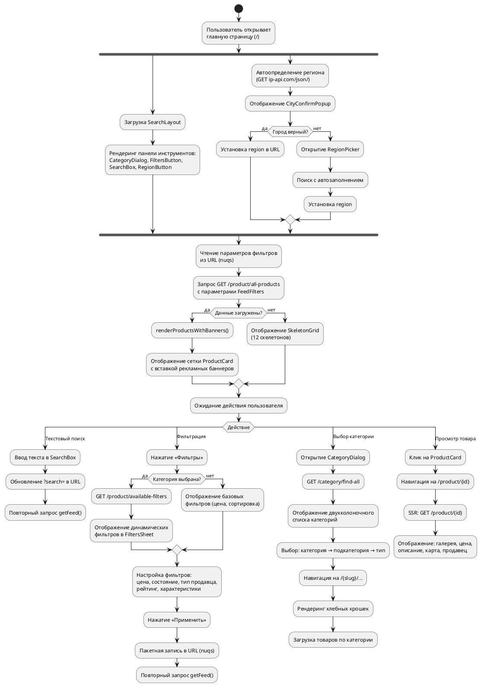
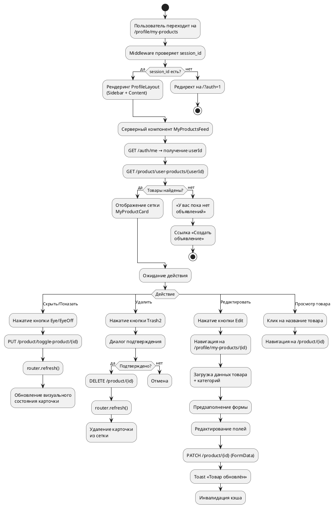

# 4. Рабочий проект

## 4.1 Описание программы

### 4.1.1 Функционирование программы

#### Назначение программы

Программа «Торгуй сам» представляет собой веб-приложение — онлайн-маркетплейс (доска объявлений), предназначенный для размещения и поиска товаров частными лицами, индивидуальными предпринимателями и юридическими лицами. Приложение построено на основе фреймворка Next.js 16 с использованием языка TypeScript и библиотеки React 19.

Основные функции программы:
- регистрация и аутентификация пользователей;
- просмотр ленты товаров с фильтрацией и поиском;
- создание, редактирование и управление объявлениями;
- управление личным кабинетом.

#### Функциональные ограничения

1. Приложение является клиентской (frontend) частью и требует подключения к внешнему REST API бэкенду через переменную окружения `NEXT_PUBLIC_API_URL`.
2. Для работы чата в реальном времени необходимо подключение к WebSocket-серверу (`NEXT_PUBLIC_API_WS_URL`).
3. Поддерживается только русская локализация интерфейса.
4. Номера телефонов принимаются только в российском формате +7 (XXX) XXX-XX-XX.
5. Для доступа к защищённым разделам (личный кабинет, создание объявлений) требуется авторизация через cookie `session_id`.

---

#### Основные этапы функционирования программы

Ниже рассмотрены ключевые пользовательские сценарии (use cases) с указанием входной и выходной информации на каждом этапе.

---

##### Сценарий 1: Регистрация пользователя

| Этап | Процедура | Входная информация | Выходная информация |
|------|-----------|--------------------|---------------------|
| 1 | Открытие диалога аутентификации | Нажатие кнопки «Войти» в шапке сайта | Отображение модального окна `AuthDialog` на экране «Вход» |
| 2 | Переход на экран регистрации | Нажатие ссылки «Зарегистрироваться» | Отображение формы `RegisterScreen` |
| 3 | Заполнение формы регистрации | ФИО (`fullName`), Email (`email`), Телефон (`phoneNumber`), Пароль (`password`), Способ верификации (`where`: SMS / Telegram) | Валидация полей по схеме `registerSchema` (Zod) |
| 4 | Отправка данных на сервер | Валидные данные формы | `POST /auth/sign-up?where=sms|telegram` → Сервер создаёт учётную запись и отправляет код подтверждения |
| 5 | Переход на экран верификации | Номер телефона из этапа 3 | Отображение формы `VerifyCodeScreen` с предзаполненным номером |
| 6 | Ввод кода подтверждения | 6-значный код (`code`) | Валидация по схеме `verifyMobileCodeSchema` (regex `^\d{6}$`) |
| 7 | Подтверждение кода | Валидный код + номер телефона | `POST /auth/verify-mobile-code` → Toast «Регистрация прошла успешно!», переход на экран «Вход» |

**Объекты, участвующие в процессе:**

| Объект | Тип | Назначение |
|--------|-----|------------|
| `AuthDialog` | React-компонент | Модальное окно, управляющее переключением между экранами (`screen: AuthScreen`) |
| `RegisterScreen` | React-компонент | Экран формы регистрации с полями ввода |
| `RegisterForm` | React-компонент | Форма с валидацией через `react-hook-form` + `zodResolver(registerSchema)` |
| `VerifyCodeScreen` | React-компонент | Экран ввода SMS-кода |
| `registerSchema` | Zod-схема | Декларативная валидация: `fullName` — обязательное, `email` — валидный, `phoneNumber` — российский формат, `password` — мин. 6 символов |
| `useRegisterMutation` | React Query хук | Мутация: `POST /auth/sign-up`, при успехе вызывает `onSuccess` с переходом на экран верификации |
| `useVerifyMobileCodeMutation` | React Query хук | Мутация: `POST /auth/verify-mobile-code`, при успехе возврат на экран входа |

---

##### Сценарий 2: Авторизация пользователя

| Этап | Процедура | Входная информация | Выходная информация |
|------|-----------|--------------------|---------------------|
| 1 | Открытие диалога аутентификации | Нажатие кнопки «Войти» или редирект с `?auth=1` | Отображение экрана `LoginScreen` |
| 2 | Заполнение формы входа | Логин (`login` — email или телефон), Пароль (`password`) | Валидация по схеме `loginSchema` (оба поля обязательны) |
| 3 | Отправка данных | Валидные учётные данные | `POST /auth/sign-in` → Сервер возвращает объект `User` и устанавливает `session_id` |
| 4 | Обработка ответа | Объект пользователя от сервера | Установка cookie `session_id`, запись `User` в кэш React Query (`["user", "current"]`), закрытие диалога |
| 5 | Обновление интерфейса | Данные пользователя в кэше | Шапка сайта отображает имя пользователя, аватар, доступ к личному кабинету |

**Объекты, участвующие в процессе:**

| Объект | Тип | Назначение |
|--------|-----|------------|
| `LoginScreen` | React-компонент | Экран формы входа |
| `LoginForm` | React-компонент | Форма с `react-hook-form` + `zodResolver(loginSchema)` |
| `loginSchema` | Zod-схема | Валидация: `login` и `password` — обязательные строки |
| `useLoginMutation` | React Query хук | Мутация: `POST /auth/sign-in`, при успехе устанавливает cookie и обновляет кэш пользователя |
| `useCurrentUser` | React Query хук | Запрос `GET /auth/me`, ключ кэша `["user", "current"]`, используется для получения текущего пользователя |
| `middleware.ts` | Next.js Middleware | Edge-middleware, проверяет наличие `session_id` для защищённых маршрутов `/profile/*` и `/admin/*` |

---

##### Сценарий 3: Просмотр ленты товаров

| Этап | Процедура | Входная информация | Выходная информация |
|------|-----------|--------------------|---------------------|
| 1 | Загрузка главной страницы | URL `/` | Рендеринг `SearchLayout` с панелью инструментов и компонентом `ProductFeed` |
| 2 | Определение региона | IP-адрес пользователя | `GET http://ip-api.com/json/` → название города, отображение `CityConfirmPopup` |
| 3 | Загрузка товаров | Текущие URL-параметры фильтров (по умолчанию — пустые) | `GET /product/all-products` → массив `Product[]`, отображение сетки карточек |
| 4 | Отображение карточек | Массив `Product[]` | Рендеринг `ProductCard` для каждого товара: превью изображений, название, адрес, цена, кнопка избранного |
| 5 | Вставка рекламных баннеров | Баннеры из `GET /banner?place=PRODUCT_FEED` | Вставка `ProductFeedBanner` на позиции 1, далее каждые 6 элементов; `WideBanner` каждые 20 элементов |
| 6 | Навигация по категориям | Нажатие на категорию | Переход на `/{categorySlug}`, `/{categorySlug}/{subcategorySlug}`, `/{categorySlug}/{subcategorySlug}/{typeSlug}` |

**Объекты, участвующие в процессе:**

| Объект | Тип | Назначение |
|--------|-----|------------|
| `ProductFeed` | React-компонент (`"use client"`) | Главный компонент ленты: читает фильтры из URL (nuqs), вызывает `getFeed()`, рендерит сетку с баннерами |
| `ProductCard` | React-компонент (compound) | Составной компонент карточки товара: `ProductCardMedia`, `ProductCardContent`, `ProductCardTitle`, `ProductCardAddress`, `ProductCardPrice`, `ProductCardAction` |
| `ProductCardPreview` | React-компонент | Интерактивная карусель изображений — переключение фото по позиции мыши |
| `LikeButton` | React-компонент | Кнопка избранного с оптимистичным обновлением состояния |
| `CategoryDialog` | React-компонент | Двухколоночный диалог выбора категории: левая колонка — категории, правая — подкатегории и типы |
| `SearchBox` | React-компонент | Поле текстового поиска, синхронизированное с URL-параметром `search` |
| `RegionButton` | React-компонент | Кнопка выбора региона с автоопределением по IP |
| `FeedFilters` | TypeScript-интерфейс | Описание всех параметров фильтрации: `categorySlug`, `search`, `minPrice`, `maxPrice`, `state`, `sortBy`, `region`, `profileType`, `fieldValues` и др. |
| `useQuery` | React Query хук | Запрос `GET /product/all-products` с ключом кэша `["products", filters]` |

---

##### Сценарий 4: Фильтрация и поиск товаров

| Этап | Процедура | Входная информация | Выходная информация |
|------|-----------|--------------------|---------------------|
| 1 | Текстовый поиск | Ввод текста в `SearchBox` | Обновление URL-параметра `?search=...`, повторный запрос `getFeed()` |
| 2 | Выбор категории | Навигация через `CategoryDialog` или хлебные крошки | Переход на URL `/{categorySlug}/...`, загрузка товаров по категории |
| 3 | Загрузка доступных фильтров | `categorySlug`, `subCategorySlug`, `typeSlug` | `GET /product/available-filters` → `AvailableFiltersResponse`: диапазоны цен, состояния, типы продавцов, динамические характеристики |
| 4 | Открытие панели фильтров | Нажатие кнопки «Фильтры» (`FiltersButton`) | Отображение боковой панели `FiltersSheet` с элементами управления |
| 5 | Настройка фильтров | Установка значений: диапазон цен, состояние (новый/б/у), тип продавца, рейтинг, динамические поля характеристик, сортировка | Локальное состояние фильтров в `FiltersSheet` |
| 6 | Применение фильтров | Нажатие кнопки «Применить» | Пакетная запись фильтров в URL-параметры через `nuqs`, повторный запрос `getFeed()` с обновлёнными параметрами |
| 7 | Сброс фильтров | Нажатие кнопки «Сбросить» | Очистка всех URL-параметров фильтров, возврат к полной ленте |

**Параметры фильтрации (FeedFilters):**

| Параметр | Тип | Описание |
|----------|-----|----------|
| `search` | `string` | Текстовый поиск по названию |
| `categorySlug` | `string` | Slug категории |
| `subCategorySlug` | `string` | Slug подкатегории |
| `typeSlug` | `string` | Slug типа товара |
| `minPrice` / `maxPrice` | `number` | Диапазон цены |
| `state` | `"NEW" \| "USED"` | Состояние товара |
| `profileType` | `"INDIVIDUAL" \| "IP" \| "OOO"` | Тип продавца |
| `minRating` / `maxRating` | `number` (1–5) | Рейтинг продавца |
| `fieldValues` | `Record<string, string>` | Динамические характеристики (JSON в URL) |
| `sortBy` | `string` | Сортировка: по дате, цене, релевантности |
| `region` | `string` | Регион / город |
| `page` / `limit` | `number` | Пагинация |

**Объекты, участвующие в процессе:**

| Объект | Тип | Назначение |
|--------|-----|------------|
| `FiltersSheet` | React-компонент | Боковая панель фильтров (`Sheet`), локальное состояние + синхронизация с URL при «Применить» |
| `FiltersButton` | React-компонент | Извлекает slug'и категорий из `pathname`, открывает `FiltersSheet` |
| `useAvailableFilters` | React Query хук | Запрос `GET /product/available-filters`, включён только при наличии `categorySlug` |
| `AvailableFiltersResponse` | TypeScript-интерфейс | Ответ с доступными значениями: `fields[]`, `priceRange`, `states[]`, `profileTypes[]`, `ratingRange` |
| `nuqs` (useQueryState / useQueryStates) | Библиотека | Типобезопасная синхронизация состояния фильтров с URL query-параметрами |

---

##### Сценарий 5: Создание объявления

| Этап | Процедура | Входная информация | Выходная информация |
|------|-----------|--------------------|---------------------|
| 1 | Переход на страницу создания | Навигация на `/profile/create-product` | Проверка `session_id` в middleware → отображение формы создания |
| 2 | Заполнение основных полей | Название (`name`), Цена (`price`), Описание (`description`), Состояние (`state`: «Новое» / «Б/У») | Сохранение в локальном состоянии `formData` |
| 3 | Выбор категории (каскадный) | Выбор категории → подкатегории → типа | Каскадная загрузка: `Category[] → Subcategory[] → SubcategoryType[]`, сброс зависимых полей при изменении родительского |
| 4 | Заполнение динамических полей | Значения характеристик, определяемые выбранным типом (`fields[]`) | Запись в `fieldValues: Record<string, string>` |
| 5 | Загрузка изображений | Выбор файлов через `ImageUpload` (до 8 изображений) | Массив `File[]`, превью через `URL.createObjectURL()`, выбор главного изображения |
| 6 | Указание адреса на карте | Взаимодействие с `AddressMap` (Leaflet): клик на карте / ввод адреса с автозаполнением | Адрес (`address`), координаты (`lat`, `lng`) |
| 7 | Валидация формы | Все поля формы | Проверка обязательных полей: `name`, `price > 0`, `state`, `categoryId`, `subcategoryId`, `typeId`, `images.length > 0` |
| 8 | Отправка на сервер | Данные формы в `FormData` | `POST /product/create` → Товар создан со статусом `MODERATE` |
| 9 | Обработка результата | Ответ сервера (успех/ошибка) | Toast «Товар отправлен на модерацию», редирект на `/profile/my-products` |

**Объекты, участвующие в процессе:**

| Объект | Тип | Назначение |
|--------|-----|------------|
| `CreateProductPage` | React-компонент (`"use client"`) | Страница формы создания товара, управление состоянием через `useState` |
| `ImageUpload` | React-компонент | Загрузка изображений: множественный выбор, превью, выбор главного изображения, удаление |
| `AddressMap` | React-компонент | Интерактивная карта Leaflet: автогеолокация, автозаполнение адреса, клик для выбора точки, обратное геокодирование через Nominatim |
| `useCreateProductMutation` | React Query хук | Мутация `POST /product/create` с `FormData` |
| `createProduct` | Функция API | Формирует `FormData` с полями: `name`, `price`, `state`, `categoryId`, `subcategoryId`, `typeId`, `images[]`, `fieldValues` (JSON), опционально `description`, `address`, `latitude`, `longitude`, `videoUrl` |
| `createProductSchema` | Zod-схема | Описание типов: `name` — строка, `price` — число ≥ 0, `state` — «NEW» / «USED», ID категорий — числа |

---

##### Сценарий 6: Личный кабинет — раздел «Мои товары»

| Этап | Процедура | Входная информация | Выходная информация |
|------|-----------|--------------------|---------------------|
| 1 | Переход в личный кабинет | Навигация на `/profile/my-products` | Middleware проверяет `session_id`, рендеринг `ProfileLayout` с боковой панелью |
| 2 | Загрузка товаров | ID текущего пользователя | `GET /auth/me → GET /product/user-products/{userId}` → массив `Product[]` |
| 3 | Отображение списка | Массив товаров пользователя | Сетка `MyProductCard` с визуальным отображением статусов: активный / скрытый / на модерации / отклонён |
| 4 | Скрытие/показ товара | Нажатие кнопки с иконкой глаза | `PUT /product/toggle-product/{id}` → обновление страницы |
| 5 | Удаление товара | Нажатие кнопки удаления → подтверждение | `DELETE /product/{id}` → обновление страницы |
| 6 | Переход к редактированию | Нажатие кнопки редактирования | Навигация на `/profile/my-products/{productId}` — форма редактирования |
| 7 | Редактирование товара | Изменённые поля формы + загрузка/удаление изображений | `PATCH /product/{id}` с `FormData` → Toast «Товар обновлён», инвалидация кэша |

**Визуальные состояния карточки (MyProductCard):**

| Состояние | Условие | Внешний вид |
|-----------|---------|-------------|
| Активный | По умолчанию | Стандартная карточка |
| Скрытый | `product.isHide === true` | Затемнённая карточка, перечёркнутый текст, оверлей «Объявление снято с продажи» |
| На модерации | `moderateState === "MODERATE"` | Синий оттенок, оверлей «На модерации» |
| Отклонён | `moderateState === "DENIED"` | Красный оттенок, оверлей «Не прошел модерацию» |

**Объекты, участвующие в процессе:**

| Объект | Тип | Назначение |
|--------|-----|------------|
| `ProfileLayout` | React-компонент | Layout личного кабинета: CSS Grid (боковая панель 320px + контент) |
| `Sidebar` | React-компонент | Боковая панель: аватар, ФИО, рейтинг, баланс, навигация по разделам |
| `MyProductsFeed` | React-компонент (серверный) | Загружает товары пользователя на сервере, рендерит сетку |
| `MyProductCard` | React-компонент | Карточка товара с кнопками действий: скрыть/показать (Eye), редактировать (Edit), удалить (Trash2) |
| `useToggleProductMutation` | React Query хук | Мутация `PUT /product/toggle-product/{id}` |
| `useDeleteProductMutation` | React Query хук | Мутация `DELETE /product/{id}`, инвалидация `["currentUserProducts"]` |
| `useUpdateProductMutation` | React Query хук | Мутация `PATCH /product/{id}`, инвалидация `["product", id]` и `["currentUserProducts"]` |

---

#### Диаграмма прецедентов (Use Case Diagram)



---

### 4.1.2 Логика работы программы

#### Укрупнённый алгоритм работы программы

Программа функционирует по следующему укрупнённому алгоритму:

1. **Инициализация приложения.** При загрузке корневого `layout.tsx` на сервере выполняется `prefetchQuery` для получения текущего пользователя (`GET /auth/me`). Данные передаются клиенту через `HydrationBoundary` с `dehydrate(queryClient)`.

2. **Инициализация провайдеров.** Клиентский компонент `Providers` оборачивает приложение в цепочку:
   ```
   NuqsAdapter → QueryClientProvider → HydrationBoundary → AuthProvider → ChatSocketProvider
   ```

3. **Маршрутизация.** Next.js App Router определяет, какую страницу рендерить. Middleware (`middleware.ts`) на уровне Edge проверяет наличие cookie `session_id` для защищённых маршрутов.

4. **Рендеринг страницы.** В зависимости от маршрута рендерится соответствующий layout и страница: публичная лента, страница товара, личный кабинет или панель администратора.

5. **Взаимодействие с API.** Все запросы к бэкенду выполняются через HTTP-клиент `ofetch` с автоматической отправкой cookies и поддержкой SSR.

6. **Управление состоянием.** Серверное состояние управляется через TanStack React Query с кэшированием (`staleTime: 60s`). Состояние фильтров синхронизируется с URL через `nuqs`.

---

#### Структура программы

Программа организована по модульной архитектуре с элементами Feature-Sliced Design:

```
src/
├── app/                          # Маршруты и страницы (Next.js App Router)
│   ├── (feed)/(search)/          # Модуль ленты и поиска товаров
│   ├── profile/                  # Модуль личного кабинета
│   └── admin/                    # Модуль администрирования
├── components/                   # Переиспользуемые компоненты
│   ├── ui/                       # Базовые UI-компоненты (shadcn/ui)
│   ├── auth-dialog/              # Модуль аутентификации
│   ├── product-card/             # Карточки товаров
│   └── ...                       # Прочие бизнес-компоненты
├── lib/                          # Сервисный слой
│   ├── api/                      # HTTP-клиент, запросы, хуки, типы
│   └── contexts/                 # React-контексты
├── hooks/                        # Общие React-хуки
└── types/                        # TypeScript-типы данных
```

---

#### Диаграмма компонентов

Диаграмма компонентов показывает логические группы элементов системы и их взаимосвязи:

```plantuml
@startuml ComponentDiagram
skinparam componentStyle uml2
skinparam linetype ortho

package "Клиент (Browser)" {

  package "Уровень представления (UI)" {
    [Layout & Providers] as LP
    [Header / Footer] as HF
    [AuthDialog] as AD

    package "Модуль ленты и поиска" {
      [ProductFeed] as PF
      [ProductCard] as PC
      [FiltersSheet] as FS
      [SearchBox] as SB
      [CategoryDialog] as CD
      [RegionButton] as RB
    }

    package "Модуль личного кабинета" {
      [CreateProductPage] as CP
      [MyProductsFeed] as MP
      [MyProductCard] as MC
      [EditProductPage] as EP
      [Sidebar] as SBR
    }

    package "UI-компоненты (shadcn/ui)" {
      [Button] as BTN
      [Input / Textarea] as INP
      [Dialog / Sheet] as DLG
      [Select] as SEL
      [ImageUpload] as IU
      [AddressMap] as AM
    }
  }

  package "Уровень управления состоянием" {
    [React Query\n(QueryClient)] as RQ
    [nuqs\n(URL State)] as NQ
    [React Context\n(Auth, Chat)] as RC
  }

  package "Уровень доступа к данным (API Layer)" {
    [HTTP-клиент\n(ofetch)] as HTTP

    package "Запросы (requests)" {
      [auth/*] as R_AUTH
      [product/*] as R_PROD
      [category/*] as R_CAT
      [favorite/*] as R_FAV
      [address/*] as R_ADDR
    }

    package "Хуки (hooks)" {
      [useLoginMutation] as H_LOGIN
      [useRegisterMutation] as H_REG
      [useCreateProductMutation] as H_CREATE
      [useCurrentUser] as H_USER
      [useAvailableFilters] as H_FILTERS
      [useCategories] as H_CAT
    }
  }
}

package "Внешние сервисы" {
  [REST API\nБэкенд] as API
  [WebSocket\nСервер] as WS
  [Nominatim\n(OpenStreetMap)] as OSM
  [IP-API] as IPAPI
}

' Связи UI → Состояние
PF --> RQ : useQuery
PF --> NQ : useQueryStates
FS --> NQ : setFilters
FS --> H_FILTERS
SB --> NQ : setSearch
CD --> H_CAT
AD --> H_LOGIN
AD --> H_REG
CP --> H_CREATE
MP --> R_PROD
MC --> RQ : mutations
RB --> IPAPI : getCityByIp

' Связи Состояние → API
RQ --> HTTP
H_LOGIN --> R_AUTH
H_REG --> R_AUTH
H_CREATE --> R_PROD
H_USER --> R_AUTH
H_FILTERS --> R_PROD
H_CAT --> R_CAT

' Связи API → Внешние
HTTP --> API : REST
RC --> WS : Socket.IO
AM --> OSM : reverse geocode
R_ADDR --> API

' Связи UI внутренние
LP --> HF
LP --> AD
CP --> IU
CP --> AM
SBR --> H_USER

@enduml
```



---

#### Диаграммы деятельности (Activity Diagrams)

##### Диаграмма деятельности: Регистрация и авторизация



##### Диаграмма деятельности: Просмотр ленты, фильтрация и поиск



##### Диаграмма деятельности: Создание объявления

```plantuml
@startuml Activity_CreateProduct
start

:Пользователь переходит на\n/profile/create-product;

:Middleware проверяет session_id;

if (session_id есть?) then (да)
  :Рендеринг CreateProductPage;
else (нет)
  :Редирект на /?auth=1;
  stop
endif

:Загрузка списка категорий\nGET /category/find-all;

:Заполнение основных полей:\nназвание, цена, описание,\nсостояние (Новое/Б/У);

:Каскадный выбор категории;
:Выбор категории из <select>;
:Загрузка подкатегорий\nвыбранной категории;
:Выбор подкатегории;
:Загрузка типов\nвыбранной подкатегории;
:Выбор типа;
:Загрузка динамических полей\nхарактеристик выбранного типа;
:Заполнение характеристик\n(fieldValues);

:Загрузка изображений\nчерез ImageUpload (до 8 шт.);
:Выбор главного изображения;

:Выбор адреса на карте\n(AddressMap / Leaflet);

if (Указан видео-URL?) then (да)
  :Заполнение поля videoUrl;
else (нет)
endif

:Нажатие «Создать объявление»;

:Валидация формы;

if (Все обязательные поля\nзаполнены и валидны?) then (да)
  :Формирование FormData;
  :POST /product/create;

  if (Создание успешно?) then (да)
    :Toast «Товар отправлен\nна модерацию»;
    :Сброс формы;
    :Редирект на\n/profile/my-products;
    stop
  else (нет)
    :Отображение ошибки;
    detach
  endif
else (нет)
  :Отображение ошибок\nвалидации полей;
  detach
endif

@enduml
```



##### Диаграмма деятельности: Личный кабинет — «Мои товары»



---

#### Описание ключевых объектов и их свойств/методов

##### Объект `User`

```typescript
interface User {
  id: number;                    // Уникальный идентификатор
  email?: string;                // Электронная почта
  fullName: string;              // ФИО
  phoneNumber: string;           // Телефон (+7...)
  profileType: string;           // Тип: "INDIVIDUAL" | "IP" | "OOO"
  rating: number | null;         // Средний рейтинг (1-5)
  photo: string | null;          // URL аватара
  balance: number;               // Баланс (руб.)
  bonusBalance?: number;         // Бонусный баланс
  products?: number;             // Количество товаров
  isBanned?: boolean;            // Заблокирован
}
```

**Последовательность обращений:**
1. `GET /auth/me` → получение объекта `User`
2. Кэширование в React Query (`["user", "current"]`)
3. Доступ через `useCurrentUser()` → свойства `user.fullName`, `user.photo`, `user.balance`
4. Обновление: `PATCH /user/update-settings` (FormData)

##### Объект `Product`

```typescript
interface Product {
  id: number;                    // Уникальный идентификатор
  name: string;                  // Название товара
  address: string;               // Адрес
  createdAt: string;             // Дата создания (ISO)
  images: string[];              // URLs изображений
  isFavorited: boolean;          // В избранном у текущего пользователя
  isHide?: boolean;              // Скрыт владельцем
  moderateState?: string;        // "APPROVED" | "DENIED" | "MODERATE"
  price: number;                 // Цена (руб.)
  userId: number;                // ID владельца
  videoUrl?: string | null;      // Ссылка на видео
  hasPromotion?: boolean;        // Продвигается
}
```

**Последовательность обращений:**
1. `POST /product/create` (FormData) → создание, статус `MODERATE`
2. `GET /product/all-products?...` → получение массива для ленты
3. `GET /product/user-products/{userId}` → товары конкретного пользователя
4. `GET /product/{id}` → детальная информация
5. `PATCH /product/{id}` → обновление
6. `PUT /product/toggle-product/{id}` → скрытие/показ
7. `DELETE /product/{id}` → удаление

##### Объект `Category`

```typescript
interface Category {
  id: number;                            // Уникальный идентификатор
  name: string;                          // Название категории
  slug: string;                          // Slug для URL
  subCategories: Subcategory[];          // Подкатегории
}

interface Subcategory {
  id: number;
  name: string;
  slug: string;
  subcategoryTypes: SubcategoryType[];   // Типы товаров
}

interface SubcategoryType {
  id: number;
  name: string;
  slug: string;
  fields: Field[];                       // Характеристики типа
}

interface Field {
  id: number;
  name: string;                          // Название (напр. "Объём памяти")
}
```

**Последовательность обращений:**
1. `GET /category/find-all` → все категории для `CategoryDialog` и формы создания
2. `GET /category/slug/{slug}` → категория с подкатегориями (SSR, для хлебных крошек)
3. Каскадный выбор: `Category → Subcategory → SubcategoryType → Fields`
4. `GET /product/available-filters` → доступные значения характеристик для фильтрации

##### Объект `FeedFilters`

```typescript
interface FeedFilters {
  search?: string;               // Текстовый поиск
  categorySlug?: string;         // Slug категории
  subCategorySlug?: string;      // Slug подкатегории
  typeSlug?: string;             // Slug типа товара
  minPrice?: number;             // Минимальная цена
  maxPrice?: number;             // Максимальная цена
  state?: "NEW" | "USED";       // Состояние товара
  profileType?: string;          // Тип продавца
  minRating?: number;            // Мин. рейтинг продавца
  maxRating?: number;            // Макс. рейтинг продавца
  fieldValues?: Record<string, string>; // Характеристики
  sortBy?: string;               // Сортировка
  region?: string;               // Регион
  page?: number;                 // Номер страницы
  limit?: number;                // Количество на странице
}
```

**Последовательность обращений:**
1. Чтение из URL через `useQueryStates` (nuqs)
2. Маппинг значений пользовательского интерфейса → значений API (например, `"price-desc"` → `"price_desc"`)
3. Передача в `getFeed({ query: filters })`
4. При изменении → обновление URL → автоматический повторный запрос через React Query

---

#### Схема последовательности обращений к объектам

```
┌────────┐     ┌──────────┐     ┌──────────┐     ┌──────────┐     ┌─────────┐
│ Browser │     │ Next.js  │     │ React    │     │ ofetch   │     │ REST    │
│  (DOM)  │     │ Router   │     │ Query    │     │ (HTTP)   │     │  API    │
└────┬───┘     └────┬─────┘     └────┬─────┘     └────┬─────┘     └────┬────┘
     │              │                │                │                │
     │  URL /       │                │                │                │
     │─────────────>│                │                │                │
     │              │  layout.tsx    │                │                │
     │              │  prefetch      │                │                │
     │              │───────────────>│  GET /auth/me  │                │
     │              │                │───────────────>│                │
     │              │                │                │───────────────>│
     │              │                │                │<───────────────│
     │              │                │<───────────────│  User          │
     │              │<───────────────│                │                │
     │              │                │                │                │
     │  Hydration   │  ProductFeed   │                │                │
     │<─────────────│───────────────>│                │                │
     │              │                │  GET /product/ │                │
     │              │                │  all-products  │                │
     │              │                │───────────────>│                │
     │              │                │                │───────────────>│
     │              │                │                │<───────────────│
     │              │                │<───────────────│  Product[]     │
     │  Render      │                │                │                │
     │  ProductCard │                │                │                │
     │<─────────────│                │                │                │
     │              │                │                │                │
     │  Click       │                │                │                │
     │  "Фильтры"   │                │                │                │
     │─────────────>│                │                │                │
     │              │  FiltersSheet  │                │                │
     │              │───────────────>│  GET /product/ │                │
     │              │                │  available-    │                │
     │              │                │  filters       │                │
     │              │                │───────────────>│                │
     │              │                │                │───────────────>│
     │              │                │                │<───────────────│
     │              │                │<───────────────│  Filters       │
     │  Render      │                │                │                │
     │  filters UI  │                │                │                │
     │<─────────────│                │                │                │
     │              │                │                │                │
     │  Apply       │  Update URL    │                │                │
     │  filters     │  (nuqs)        │                │                │
     │─────────────>│───────────────>│  Re-fetch      │                │
     │              │                │  products      │                │
     │              │                │───────────────>│                │
     │              │                │                │───────────────>│
     │              │                │                │<───────────────│
     │              │                │<───────────────│  Product[]     │
     │  Re-render   │                │                │  (filtered)    │
     │<─────────────│                │                │                │
```

---

#### Логика работы модулей

##### Модуль аутентификации (`src/components/auth-dialog/`)

**Назначение:** Обеспечение регистрации, входа, верификации и восстановления пароля.

**Логика работы:**

1. Компонент `AuthDialog` управляет состоянием текущего экрана через `useState<AuthScreen>` (значения: `"login"`, `"register"`, `"verify-code"`, `"recover"`).
2. При открытии диалога всегда отображается экран входа (`"login"`).
3. Каждый экран содержит форму, управляемую через `react-hook-form` с `zodResolver` для валидации.
4. При успешной отправке формы вызывается соответствующая мутация React Query, которая выполняет HTTP-запрос к API.
5. При успешном входе: устанавливается cookie `session_id`, данные пользователя записываются в кэш React Query, диалог закрывается.
6. При успешной регистрации: состояние переключается на `"verify-code"` с передачей номера телефона.
7. При закрытии диалога: состояние сбрасывается на `"login"`, номер телефона очищается.

```
AuthDialog [screen: AuthScreen, phoneNumber: string]
├── LoginScreen
│   └── LoginForm [react-hook-form + loginSchema]
│       └── useLoginMutation → POST /auth/sign-in
├── RegisterScreen
│   └── RegisterForm [react-hook-form + registerSchema]
│       └── useRegisterMutation → POST /auth/sign-up
├── VerifyCodeScreen
│   └── VerifyCodeForm [react-hook-form + verifyMobileCodeSchema]
│       └── useVerifyMobileCodeMutation → POST /auth/verify-mobile-code
└── RecoverScreen
    └── RecoverForm [react-hook-form + forgotPasswordSchema]
        └── useRecoverMutation → POST /auth/forgot-password
```

##### Модуль ленты и поиска (`src/app/(feed)/(search)/`)

**Назначение:** Отображение каталога товаров с поддержкой фильтрации, поиска и навигации по категориям.

**Логика работы:**

1. `SearchLayout` рендерит панель инструментов: `CategoryDialog`, `FiltersButton`, `SearchBox`, `RegionButton`.
2. Компонент `ProductFeed` (клиентский) при монтировании считывает текущие URL-параметры через `useQueryStates` (nuqs).
3. Параметры объединяются с фильтрами уровня страницы (slug'и категорий из маршрута).
4. Выполняется запрос `GET /product/all-products` с объединёнными параметрами.
5. Полученный массив товаров обрабатывается функцией `renderProductsWithBanners()`, которая вставляет рекламные баннеры на определённые позиции.
6. Каждый товар рендерится как составной компонент `ProductCard` с контекстом `ProductCardProvider`.
7. При изменении любого фильтра обновляется URL → React Query обнаруживает изменение ключа кэша → автоматически выполняется повторный запрос.

```
SearchLayout
├── CategoryDialog → useCategories() → GET /category/find-all
├── FiltersButton → FiltersSheet
│   ├── useAvailableFilters() → GET /product/available-filters
│   └── localFilters → nuqs → URL params
├── SearchBox → nuqs → ?search=
├── RegionButton → getCityByIp() → CityConfirmPopup / RegionPicker
└── [Page Content]
    └── ProductFeed
        ├── useQueryStates() ← URL params (nuqs)
        ├── useQuery(["products", filters]) → getFeed() → GET /product/all-products
        └── renderProductsWithBanners()
            ├── ProductFeedBanner (позиция 1, каждые 6)
            ├── WideBanner (каждые 20)
            └── ProductCard (compound)
                ├── ProductCardPreview (карусель изображений)
                ├── ProductCardTitle
                ├── ProductCardAddress
                ├── ProductCardPrice
                └── ProductCardAction (LikeButton)
```

##### Модуль создания объявления (`src/app/profile/create-product/`)

**Назначение:** Предоставление формы для создания нового объявления с загрузкой изображений, выбором категории и указанием адреса.

**Логика работы:**

1. Страница `CreateProductPage` — клиентский компонент, управляющий состоянием формы через `useState`.
2. При монтировании загружается список категорий (`GET /category/find-all`).
3. Каскадный выбор: при выборе категории загружаются подкатегории, при выборе подкатегории — типы, при выборе типа — динамические поля характеристик.
4. Компонент `ImageUpload` позволяет загрузить до 8 изображений, выбрать главное, удалить.
5. Компонент `AddressMap` предоставляет интерактивную карту Leaflet с автогеолокацией, автозаполнением адреса и обратным геокодированием.
6. При нажатии «Создать» выполняется ручная валидация обязательных полей.
7. Данные формируются в `FormData` (включая файлы изображений) и отправляются через `POST /product/create`.
8. Товар создаётся со статусом `MODERATE`. Пользователь перенаправляется на `/profile/my-products`.

```
CreateProductPage [formData: state, images: File[], fieldValues: Record]
├── Основные поля: name, price, description, state
├── Каскадный выбор категории
│   ├── <select> Категория → categoryId
│   ├── <select> Подкатегория → subcategoryId
│   └── <select> Тип → typeId → fields[]
│       └── Динамические <input> → fieldValues[fieldId]
├── ImageUpload [images: File[], mainImageIndex: number]
│   ├── Множественный выбор файлов (до 8)
│   ├── Превью через URL.createObjectURL()
│   ├── Выбор главного изображения
│   └── Удаление
├── AddressMap [value: string, coordinates: {lat, lng}]
│   ├── Leaflet карта с маркером
│   ├── Автогеолокация (navigator.geolocation)
│   ├── Автозаполнение (GET /address/suggestions)
│   └── Обратное геокодирование (Nominatim)
├── videoUrl (опционально)
└── handleSubmit()
    ├── Валидация обязательных полей
    ├── Формирование FormData
    └── useCreateProductMutation → POST /product/create
```

##### Модуль «Мои товары» (`src/app/profile/my-products/`)

**Назначение:** Отображение списка товаров текущего пользователя с возможностью управления: скрытие/показ, редактирование, удаление.

**Логика работы:**

1. Серверный компонент `MyProductsFeed` получает текущего пользователя и загружает его товары.
2. Товары отображаются в адаптивной сетке через `MyProductCard`.
3. Каждая карточка визуально отражает статус товара: активный, скрытый, на модерации, отклонён.
4. Кнопки действий: скрыть/показать (Eye/EyeOff), редактировать (Edit), удалить (Trash2).
5. При редактировании загружается страница `/profile/my-products/{productId}` с предзаполненной формой.
6. После каждого действия вызывается `router.refresh()` для обновления серверных данных.

```
MyProductsPage
└── MyProductsFeed (серверный)
    ├── getCurrentUser() → GET /auth/me
    ├── getCurrentUserProducts(userId) → GET /product/user-products/{userId}
    └── Сетка MyProductCard[]
        └── MyProductCard [product: Product]
            ├── ProductPreview (карусель изображений)
            ├── Название (ссылка на /product/{id})
            ├── Адрес, дата
            ├── Форматированная цена
            ├── Визуальные состояния
            │   ├── Активный — стандартный вид
            │   ├── Скрытый — затемнение + «Снято с продажи»
            │   ├── На модерации — синий + «На модерации»
            │   └── Отклонён — красный + «Не прошёл модерацию»
            └── Кнопки действий
                ├── Toggle → useToggleProductMutation → PUT /product/toggle/{id}
                ├── Edit → navigate → /profile/my-products/{id}
                └── Delete → confirm → useDeleteProductMutation → DELETE /product/{id}
```

##### Модуль навигации личного кабинета (`src/app/profile/_components/sidebar/`)

**Назначение:** Боковая панель навигации по разделам личного кабинета с отображением информации о пользователе.

**Структура навигации:**

| Группа | Пункт | Маршрут |
|--------|-------|---------|
| **Основное** | Мои объявления | `/profile/my-products` |
| | Сообщения | `/profile/messages` |
| | Избранное | `/profile/favorites` |
| | Настройки | `/profile/settings` |
| **Личный кабинет** | Аналитика | `/profile/analytics` |
| | Пополнение баланса | `/profile/balance` |
| **Заявки** | Продвижение товара | `/profile/promotion-request` |
| | Размещение баннера | `/profile/banner-request` |
| | Статистика баннеров | `/profile/banner-stats` |

Активный пункт определяется сравнением текущего `pathname` (хук `usePathname()`) с маршрутом ссылки и выделяется стилем `.linkActive` (синий фон, жирный шрифт).
